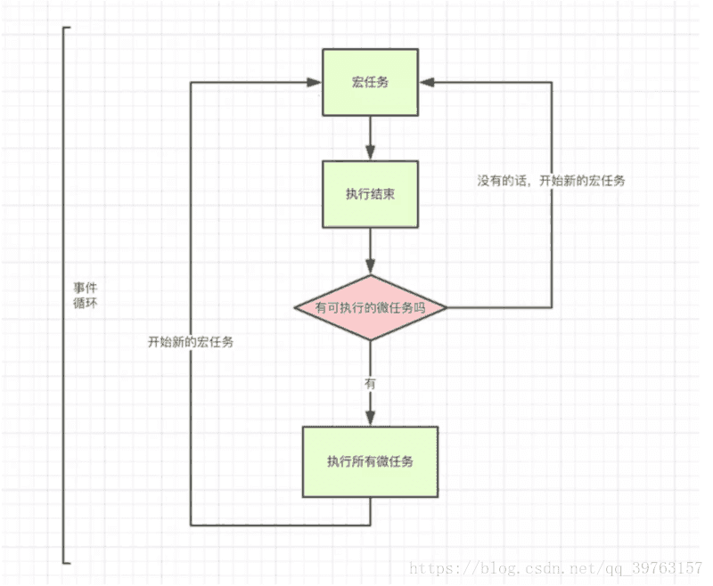
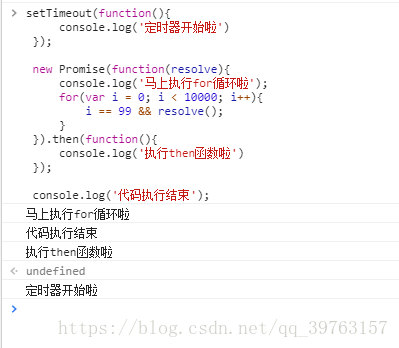

# 编程基础

### 1，三大件

- js/ts

  1. **this指向**

     首先必要说的是，this的指向在函数定义的时候是确定不了的，只有执行函数的时候才能确定this到底指向谁，实际上this的最终指向是那个调用他的对象

     情况1： 如果一个函数中有this， 但是它没有被上一级的对象所调用，那么this指向的就是window 

     情况2：如果一个函数中有this，这个函数有被上一级的对象所调用，那么this指向的就是上一级的对象。 

     情况3：如果一个函数中有this，这个函数中包含多个对象，尽管这个函数是被最外层的对象所调用，this指向的也只是它上一级的对象。代码如下:

     ```
     var o = {
         a:10,
         b:{
             a:12,
             fn:function(){
                 console.log(this.a); //12
             }
         }
     }
     o.b.fn();
     ```

     ```
     var o = {
         a:10,
         b:{
             // a:12,
             fn:function(){
                 console.log(this.a); //undefined
             }
         }
     }
     o.b.fn();
     ```

     构造函数的版的this

     ```
     function Fn(){
         this.user = "追梦子";
     }
     var a = new Fn();
     console.log(a.user); //追梦子
     ```

     这里可以点出user是因为new关键字可以改变this的指向。这里的this是指向对象a的，对象a又等于Fn函数，Fn函数中有user。

     **当this碰到return时** 

     ```
     function fn()  
     {  
         this.user = '追梦子';  
         return function(){};
     }
     var a = new fn;  
     console.log(a.user); //undefined
     ```

     ```
     function fn()  
     {  
         this.user = '追梦子';  
         return undefined;
     }
     var a = new fn;  
     console.log(a); //fn {user: "追梦子"}
     ```

     如果返回值是一个对象，那么this指向的就是那个返回的对象，如果返回值不是一个对象那么this还是指向函数的实例。 

  2. **作用域（作用域链）**

     作用域就是变量与函数的可访问范围，即作用域控制着变量与函数的可见性和生命周期。

     全局作用域：任何地方都能访问到的对象拥有全局作用域

     - 函数外面定义的变量拥有全局作用域，
     - 函数内内未定义直接赋值的变量自动声明为拥有全局作用域
     - window对象的属性拥有全局作用

     局部作用域：局部作用域一般只在固定的代码片段内可访问到，最常见的例如函数内部，也称函数作用域。

     ES6块级作用域：ES5只用全局作用域和函数作用域，没有块级作用域，就会导致变量提升，导致内层变量覆盖外层变量。用来技术的循环变量泄露成为全局变量。

     ES6引入了块级作用域，明确允许在块级作用域中声明函数，let和const命令都涉及块级作用域。const是一个声明一个只读的常量，后期不可修改，let后面可以修改。

     

     **作用域链**

     通俗来讲，当声明一个函数时，局部作用域一级一级向上包起来，就是作用域链，

     1，当执行函数时，总是先从函数内部找寻局部变量

     2，如果内部找不到（函数的局部作用域没有），则会向chain构建函数的作用域（声明函数的作用域）寻找，依次向上。

     ```
     var a = 1
     function fn() {
         var a = 10;
         function fn1() {
             var a = 20;
             console.log(a);  // 20
         }
         function fn2() {
             console.log(a); // 10
         }
         fn1();
         fn2();
     }
     fn();
     console.log(a); // 1
     ```

  3. **动态作用域和词法作用域**

     JavaScript采用的是词法作用域，函数的作用域在函数定义的时候就决定了。

     而与词法作用域对应的是动态作用域，函数的作用域是在函数调动的时候才决定的。动态作用域并不关心函数和作用域是如何声明以及在何处声明的，只关心他们从何处调动。换句话说，作用域链是基于调用栈的，而不是代码中的作用域嵌套。

  4. **闭包**

     闭包函数： 声明在一个函数中的函数，叫做闭包函数。

     闭包：内部函数总是可以访问其所在的外部函数中声明的参数和变量，即使在其外部函数被返回（寿命终结）了之后。

     特点

     让外部访问函数内部变量成为可能；

     局部变量会常住在内存中；

     可以避免使用全局变量，防止全局变量被污染；

     会造成内存泄漏（有一块内存空间被长期占用，而不被释放）

     闭包就是可以创建一个独立的环境，每个闭包里面的环境都是独立的，互不打扰。闭包会发生内存泄漏，每次外部函数执行的时候，外部函数的引用地址不同，都会重新创建一个新的地址。但凡当前活动对象中有被内部子集引用的数据，那么这个时候，这个数据不删除，保留一根指针给内部活动对象。

  5. **原型（原型链）**

     在JavaScript中，每个函数都有一个prototype属性，这个属性指向函数的原型对象。

     每个JavaScript对象（除null外）创建时候，就会与之关联另一个对象，这个对象就是我们所说的原型，每一个对象都会从原型中“继承”属性。

     每个对象（除null外）都会有属性，叫做_ protp _,这个属性会指向该对象的原型。

     

     

     原型链

     简单回顾一下构造韩式、原型和实例的关系：每个构造函数都有一个原型对象，原型对象都包含一个构造函数的指针，而实例都包含一个指向原型对象的内部指针。那么假如我们让原型对象等于另一个类型的实例，结果会怎么样？显然，此时的原型对象将包含一个指向另一个原型的指针，相对应，另一个原型中也包含着一个指向另一个构造函数的指针。假如另一个原型又是另一个类型的实例，那么上述关系依然城里。如此层层递进，就构成了实例与原型的链条。这就是所谓的原型链的基本概念

     

     

  6. **类型转换（强类型）**

     toString() ，JSON.stringify() ，valueOf() ，parseInt(parseInt, 16)等等 

  7. **javaScript执行机制Event Loop**

     js是单线程语言

     js的Event Loop是JS的执行机制

     js是单线程，但是碰到大量图片需要解析，就只能等待了，下面的代码就会阻塞，对于用户而言，体验感就很差了，这是就需要异步了，js的异步是通过时间循环（Event Loop）来实现的。

     Event Loop 执行机制是：

     首先判断js是同步还是异步，同步就进行主线程，异步就进入Event Table

     异步任务在Event Table中注册函数，当满足触发条件后，被推入到 Event Queue

     同步任务进入到主线程中一直执行，直到主线程空闲时，才会去event queue中查看是否有可执行的异步任务，如果有就推入到主线程。

     这里又分为两种任务

     macro-task(宏任务)：包括整体代码script，setTimeout，setInterval 

     micro-task(微任务)：Promise，process.nextTick 

     

     script代码块就是一个宏任务，执行一个宏任务，先执行同步代码，遇到异步代码（promise，setTimeout等）会让他们进行排队，分别排两条队。一条是宏任务S，一条是微任务P。执行完同步任务后执行微任务，同样同步任务立即执行，遇到异步任务进行排队。把全部微任务执行完就执行宏任务，宏任务执行完一个就会去清理微任务队列，所以在宏任务里面的微任务会比外面的宏任务先执行。

     

  8. **promise  &  async/await**

     promise 是同步且自动执行的，但是可以用来解决异步执行顺序的，让异步执行有先后顺序的，用来搞定异步执行异步执行后的顺序。

     promise 的三种状态

     - pending：等待状态，比如正在执行，还没有得到最终数据
     - fulfill：满足状态，当我们主动调用resolve时，说明执行成功了，就是出于改状态，并会回调.then()
     - rejected：拒绝状态，当我们主动调用reject时（没有执行成功），就处于该状态，并会回调.catch()

     async：异步的意思，用来申明一个异步的函数，会返回一个promise

     await：用来等待一个异步操作的执行，他是一个表达式，async函数内才可以使用await,await之后的代码会被阻塞。

  9. **es6+ /babel**

     babel是一个JavaScript编译器，主要用于将新版本的代码转换为向后兼容的JavaScript语法，以便能够运行在当前和旧版本的浏览器或其他环境中，下面是babel能做的事

     - 语法转换
     - 通过Polyfill 方法在目标环境中添加确实的特性
     - 源码转换

  10. **ts特有特性**

      ts是微软开发的一门编程语言，它是js的超集，它遵循最新的es6脚本语言规范，ts拓展了js的语法，任何已经存在的js程序可以不经过热河改动的在ts环境下运行，ts向js添加了一些新的遵循es6规范的语法，以及基于面向对象编程的特性。

- html

- css/scss

### 2，浏览器

1. **浏览器缓存机制**

   什么是浏览器缓存？

   浏览器缓存就是把一个请求过的web资源（如html，图片，js，数据）拷贝一份放在浏览器中。缓存会根据进来的请求保存输入内容的副本。当

2. **浏览器中JavaScript的运行机制**

3. **页面渲染原理**

4. **浏览器安全问题**

5. **跨域**

6. **页面优化**

7. **浏览器开发者使用工具**

### 3，计算机基础

### 4，常用设计模式

