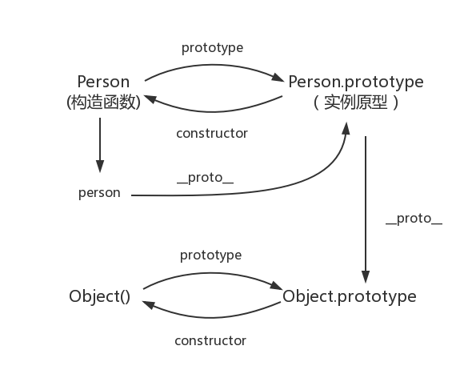

# 编程基础

### 1，三大件

- js/ts

  1. **this指向**

     首先必要说的是，在严格模式下this指向的事undefined。this的指向在函数定义的时候是确定不了的，只有执行函数的时候才能确定this到底指向谁，实际上this的最终指向是那个调用他的对象

     情况1： 如果一个函数中有this， 但是它没有被上一级的对象所调用，那么this指向的就是window 

     情况2：如果一个函数中有this，这个函数有被上一级的对象所调用，那么this指向的就是上一级的对象。 

     情况3：如果一个函数中有this，这个函数中包含多个对象，尽管这个函数是被最外层的对象所调用，this指向的也只是它上一级的对象。代码如下:

     ```
     var o = {
         a:10,
         b:{
             a:12,
             fn:function(){
                 console.log(this.a); //12
             }
         }
     }
     o.b.fn();
     ```

     ```
     var o = {
         a:10,
         b:{
             // a:12,
             fn:function(){
                 console.log(this.a); //undefined
             }
         }
     }
     o.b.fn();
     ```

     构造函数的版的this

     ```
     function Fn(){
         this.user = "追梦子";
     }
     var a = new Fn();
     console.log(a.user); //追梦子
     ```

     这里可以点出user是因为new关键字可以改变this的指向。这里的this是指向对象a的，对象a又等于Fn函数，Fn函数中有user。

     **当this碰到return时** 

     ```
     function fn()  
     {  
         this.user = '追梦子';  
         return function(){};
     }
     var a = new fn;  
     console.log(a.user); //undefined
     ```

     ```
     function fn()  
     {  
         this.user = '追梦子';  
         return undefined;
     }
     var a = new fn;  
     console.log(a); //fn {user: "追梦子"}
     ```

     如果返回值是一个对象，那么this指向的就是那个返回的对象，如果返回值不是一个对象那么this还是指向函数的实例。 

  2. **作用域（作用域链）**

     作用域就是变量与函数的可访问范围，即作用域控制着变量与函数的可见性和生命周期。

     全局作用域：任何地方都能访问到的对象拥有全局作用域

     - 函数外面定义的变量拥有全局作用域，
     - 函数内内未定义直接赋值的变量自动声明为拥有全局作用域
     - window对象的属性拥有全局作用

     局部作用域：局部作用域一般只在固定的代码片段内可访问到，最常见的例如函数内部，也称函数作用域。

     ES6块级作用域：ES5只用全局作用域和函数作用域，没有块级作用域，就会导致变量提升，导致内层变量覆盖外层变量。用来技术的循环变量泄露成为全局变量。

     ES6引入了块级作用域，明确允许在块级作用域中声明函数，let和const命令都涉及块级作用域。const是一个声明一个只读的常量，后期不可修改，let后面可以修改。

     

     **作用域链**

     通俗来讲，当声明一个函数时，局部作用域一级一级向上包起来，就是作用域链，

     1，当执行函数时，总是先从函数内部找寻局部变量

     2，如果内部找不到（函数的局部作用域没有），则会向chain构建函数的作用域（声明函数的作用域）寻找，依次向上。

     ```
     var a = 1
     function fn() {
         var a = 10;
         function fn1() {
             var a = 20;
             console.log(a);  // 20
         }
         function fn2() {
             console.log(a); // 10
         }
         fn1();
         fn2();
     }
     fn();
     console.log(a); // 1
     ```

  3. **动态作用域和词法作用域**

     JavaScript采用的是词法作用域，函数的作用域在函数定义的时候就决定了。

     而与词法作用域对应的是动态作用域，函数的作用域是在函数调动的时候才决定的。动态作用域并不关心函数和作用域是如何声明以及在何处声明的，只关心他们从何处调动。换句话说，作用域链是基于调用栈的，而不是代码中的作用域嵌套。

  4. **闭包**

     闭包函数： 声明在一个函数中的函数，叫做闭包函数。

     闭包：内部函数总是可以访问其所在的外部函数中声明的参数和变量，即使在其外部函数被返回（寿命终结）了之后。

     特点

     让外部访问函数内部变量成为可能；

     局部变量会常住在内存中；

     可以避免使用全局变量，防止全局变量被污染；

     会造成内存泄漏（有一块内存空间被长期占用，而不被释放）

     闭包就是可以创建一个独立的环境，每个闭包里面的环境都是独立的，互不打扰。闭包会发生内存泄漏，每次外部函数执行的时候，外部函数的引用地址不同，都会重新创建一个新的地址。但凡当前活动对象中有被内部子集引用的数据，那么这个时候，这个数据不删除，保留一根指针给内部活动对象。

  5. **原型（原型链）**

     在JavaScript中，每个函数都有一个prototype属性，这个属性指向函数的原型对象。

     每个JavaScript对象（除null外）创建时候，就会与之关联另一个对象，这个对象就是我们所说的原型，每一个对象都会从原型中“继承”属性。

     每个对象（除null外）都会有属性，叫做_ protp _,这个属性会指向该对象的原型。

     

     

     原型链

     简单回顾一下构造韩式、原型和实例的关系：每个构造函数都有一个原型对象，原型对象都包含一个构造函数的指针，而实例都包含一个指向原型对象的内部指针。那么假如我们让原型对象等于另一个类型的实例，结果会怎么样？显然，此时的原型对象将包含一个指向另一个原型的指针，相对应，另一个原型中也包含着一个指向另一个构造函数的指针。假如另一个原型又是另一个类型的实例，那么上述关系依然城里。如此层层递进，就构成了实例与原型的链条。这就是所谓的原型链的基本概念

     

     

  6. **类型转换（强类型）**

     toString() ，JSON.stringify() ，valueOf() ，parseInt(parseInt, 16)等等 

  7. **javaScript运行机制Event Loop**

     js是单线程语言

     js的Event Loop是JS的运行机制

     js是单线程，但是碰到大量图片需要解析，就只能等待了，下面的代码就会阻塞，对于用户而言，体验感就很差了，这是就需要异步了，js的异步是通过时间循环（Event Loop）来实现的。

     Event Loop 执行机制是：

     首先判断js是同步还是异步，同步就进行主线程，异步就进入Event Table

     异步任务在Event Table中注册函数，当满足触发条件后，被推入到 Event Queue

     同步任务进入到主线程中一直执行，直到主线程空闲时，才会去event queue中查看是否有可执行的异步任务，如果有就推入到主线程。

     这里又分为两种任务

     macro-task(宏任务)：包括整体代码script，setTimeout，setInterval 

     micro-task(微任务)：Promise，process.nextTick 

     

     script代码块就是一个宏任务，执行一个宏任务，先执行同步代码，遇到异步代码（promise，setTimeout等）会让他们进行排队，分别排两条队。一条是宏任务S，一条是微任务P。执行完同步任务后执行微任务，同样同步任务立即执行，遇到异步任务进行排队。把全部微任务执行完就执行宏任务，宏任务执行完一个就会去清理微任务队列，所以在宏任务里面的微任务会比外面的宏任务先执行。

     

  8. **promise  &  async/await**

     promise 是同步且自动执行的，但是可以用来解决异步执行顺序的，让异步执行有先后顺序的，用来搞定异步执行异步执行后的顺序。

     promise 的三种状态

     - pending：等待状态，比如正在执行，还没有得到最终数据
     - fulfill：满足状态，当我们主动调用resolve时，说明执行成功了，就是出于改状态，并会回调.then()
     - rejected：拒绝状态，当我们主动调用reject时（没有执行成功），就处于该状态，并会回调.catch()

     async：异步的意思，用来申明一个异步的函数，会返回一个promise

     await：用来等待一个异步操作的执行，他是一个表达式，async函数内才可以使用await,await之后的代码会被阻塞。

  9. **es6+ /babel**

     babel是一个JavaScript编译器，主要用于将新版本的代码转换为向后兼容的JavaScript语法，以便能够运行在当前和旧版本的浏览器或其他环境中，下面是babel能做的事

     - 语法转换
     - 通过Polyfill 方法在目标环境中添加确实的特性
     - 源码转换

  10. **ts特有特性**

      ts是微软开发的一门编程语言，它是js的超集，它遵循最新的es6脚本语言规范，ts拓展了js的语法，任何已经存在的js程序可以不经过热河改动的在ts环境下运行，ts向js添加了一些新的遵循es6规范的语法，以及基于面向对象编程的特性。

- html

- css/scss

### 2，浏览器

1. **浏览器缓存机制**

   什么是浏览器缓存？

   浏览器缓存就是把一个请求过的web资源（如html，图片，js，数据）拷贝一份放在浏览器中。缓存会根据进来的请求保存输入内容的副本。当下一个请求到来时候，如果是相同的url,浏览器会根据缓存机制决定使用副本相应访问请求还是向源服务器再次发送请求。

   使用缓存的原因

   1，减少网络带宽消耗：当web缓存副本被受用时，只会产生极小的网络流量，可以有效减低运营成本。

   2，降低服务器压力：给网络资源设定有效期限后，用户可以重复使用本地缓存，减少对源服务器的请求，间接降低了对服务器的压力。

   3：减少网络延时：缓存的使用可以明显加快页面打开速度，达到更好的用户体验。

   浏览器的缓存机制？

   对于浏览器的缓存来讲，这些规则是在http协议头部和html页面的meta标签中定义的。他们分别从新鲜度和校验值两个维度来规定浏览器是否可以直接使用缓存中的副本，还是需要去源服务器获取新版本。

   过期机制：指的事缓存副本有效期，一个缓存副本必须满足以下条件才有效：

   1，含有完整的过期时间控制头信息（HTTP协议报头），并仍在有效期内。

   2，浏览器已经使用过这个缓存副本，并在一个会话中已经检查过新鲜度。

   满足以上两种情况中的一种，即可

   校验值（验证机制）：服务器返回资源的时候在控制头信息带上这个资源的实体标签Etag，它可以用来作为浏览器再次请求过程中的校验标识，如果发现校验标识不匹配，说明资源已经被修改或者过期，浏览器需要重新获取资源。

2. **页面渲染原理**

   浏览器在接收到服务器返回的html页面后，浏览器开始构建DOM TREE ,遇到CSS样式会构建CSS RULER TREE,遇到javascript会通过DOM API和CSSOM API来操作DOM Tree 和CSS Rule Tree, 解析完成后，浏览器引擎会通过DOM Tree 和CSS Rule Tree 来构造Rendering Tree(渲染树)，最后，渲染树构建完成最后就是”布局“处理，也就是确定每个节点在屏幕上的确切显示位置。下一个步骤是 绘制------- 遍历渲染树并用UI后端层将每一个节点绘制出来。见下图

   

3. **浏览器安全问题**

   1.url安全问题，在url的解析库、编码、字符排版、ui显示、内容劫持等方面均出现过安全问题

   可视化自行欺骗钓鱼攻击，例如0，o,i,1类似字符。

   国际化域名自行欺骗攻击

   自纠错与Unicode字符分解映射，例如http:/www.example.org ->http://www.example.org 

   登录信息钓鱼攻击

   2，http协议

   注入响应头：CRLF攻击，CRLF是‘回车换行’的意思 ，CRLF攻击实际上是一个代码注入型的攻击，我们知道http头是由cr+lf确定一个字段的范围，如果末次相应数据中，有一个字段的数据是用户输入的，而服务器没有做好过滤，用户就可以通过编码cr+lf及注入的新字段发起攻击。

   相应攻击：http401钓鱼

   攻击者首先在服务器上创建一个需要认证登录才可访问的图片或者页面。然后将图片或者页面放在论坛，邮箱、博客等地方。当用户访问链接向钓鱼文件的页面时，浏览器即会弹出对话框。这种钓鱼利用了浏览器处理相应的一个特性，当用户正在访问需要认证资源时，服务器会响应http401，浏览器收到这个状态码后会根据服务器提供的认证信息，弹出窗口，让用户提供认证的用户名与密码

   3，dns请求

   chorme,ie浏览器会对用户的访问进行预测与预取，例如chorem在用户地址输入的时候就猜测用户想要访问那个网站。如果chorme猜测某个网站将被访问的可能性很高，就会提前预取改网站的数据以达到让用户‘秒开’网页的效果。无论预测是否命中，导航的最开始，浏览器都会通过DNS服务器发送请求并解析到主机对应的IP地址。

   dns劫持和dns污染

   导航尚未开始的状态同步问题	

   4，建立安全连接

   根据用户指定的url，浏览器将选择合适的方式连接，例如HTTP，HTTPS，FTP等。HTTP																												

4. **跨域**

5. **页面优化**

6. **浏览器开发者使用工具**

### 3，计算机基础

### 4，常用设计模式

1. **http与https的区别**
2. **tcp/ip协议**
3. **三次握手与四次挥手**
4. **正向代理与反向代理**
5. **CDN的作用和原理**